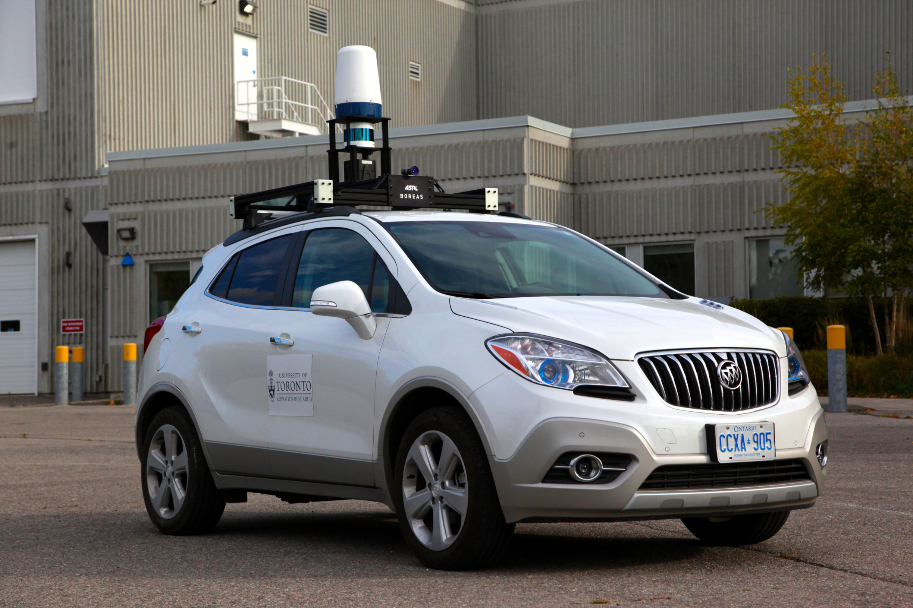

# yeti

This repo contains radar odometry code which removes motion distortion and Doppler effects from Navtech radar data. For our odometry experiments, we use the [Oxford Radar Robotcar Dataset](https://oxford-robotics-institute.github.io/radar-robotcar-dataset/). For our metric localization experiments, we use data taken using our own platform, Boreas, shown below.

## Boreas


## Odometry Performance


## Build Instructions

Dependencies:

```
Eigen 3
Boost 1.5.8
OpenCV 3
libnabo
libpointmatcher
yaml-cpp
steam
```

Note: we provide a Dockerfile which can be used to build a docker image with all the required deps already installed.

These build instructions assume you are building your project using a catkin workspace with catkin build.

Note: Eigen and OpenCV can be installed with ROS through ros-kinetic-eigen and ros-kinetic-opencv
Just remember to add "source /opt/ros/kinetic/setup.bash" to your .bashrc

Install Eigen, OpenCV and catkin tools:
```
sudo apt-get install -y ros-kinetic-eigen* ros-kinetic-opencv* python-catkin-tools
```

Alternative method for installing Eigen:

```
git clone https://gitlab.com/libeigen/eigen.git
cd eigen && mkdir build && cd build && cmake .. && make && sudo make install
```

Installing libnabo:

```
git clone https://github.com/ethz-asl/libnabo.git
cd libnabo && mkdir build && cd build && cmake .. && make && sudo make install
```

Installing libpointmatcher:

```
git clone https://github.com/ethz-asl/libpointmatcher.git
cd libpointmatcher && mkdir build && cd build && cmake .. && make && sudo make install
```

Installing yaml-cpp:

```
git clone https://github.com/jbeder/yaml-cpp.git
cd yaml-cpp && mkdir build && cd build && cmake .. && make && sudo make install
```

Installing steam:

```
mkdir \~/steam_ws && cd \~steam_ws
git clone https://github.com/utiasASRL/steam.git
cd steam && git submodule update --init --remote && cd deps/catkin && catkin build && cd ../.. && catkin build
```

Building yeti:

```
mkdir -p \~/yeti_ws/src/ && cd \~/yeti_ws/src
git clone https://github.com/keenan-burnett/yeti.git
cd ../.. && catkin init && catkin config --extend \~/steam_ws/devel/repo && catkin build
```

## Examples

`test_feature_matching.cpp` This program performs radar odometry and saves the output from the rigid estimator, motion-compensated, and motion+doppler compensated estimators.

This example relies on the [Oxford Radar Robotcar Dataset](https://oxford-robotics-institute.github.io/radar-robotcar-dataset/).

If you want to get started quickly, download their sample sequence. Note that the path to where your Oxford data is stored is hard-coded.

Example usage:
```
cd build
./test_feature_matching <sequence_name>
```

`test_localization.cpp` This program peforms metric localization between radar scans collected in opposite directions. This example relies data taken from our own platform, Boreas. Dowload some example data for this using this script (1.6 GB):

```
./scripts/download_data.sh
```

Example usage: (Note that the location of your data and the ground truth csv is hard-coded for now.)
```
./test_localization
```

## Libraries
We have written a few libraries, which may be useful to others:

`association.cpp` This library provides our implementation of rigid RANSAC to estimate the pose between two 2D or 3D pointclouds with noisy correspondences. The library also contains our implementation of motion-compensated RANSAC which provides a method for compensating for Dopler effects.

`features.cpp` This library contains efficient implementations of Sarah Cen's 2018 and 2019 feature extraction methods.

`radar_utils.cpp` This library provides utilities for working with the Oxford Radar Dataset as well as our own data format. We also provide methods for converting between Polar and Cartesian data representations.

TODO: provide data, link to paper, clean up code.
